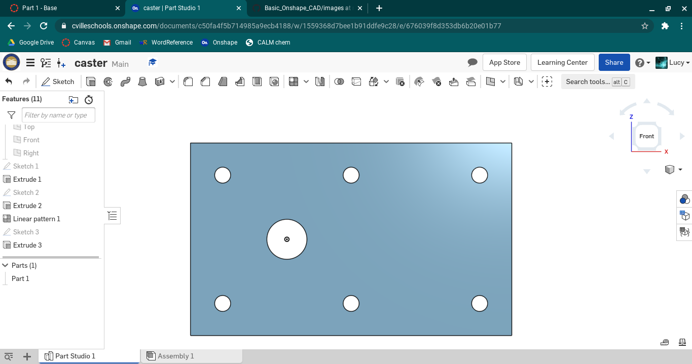

# Basic_Onshape_CAD
Work for Basic CAD canvas module

## Base

### Image

### Link
https://cvilleschools.onshape.com/documents/c50fa4f5b714985a9ecb4188/w/1559368d7bee1b91ddfe9c28/e/676039f8d353db6b20e01b77

### Reflection
This is the base part for the caster. It has seven holes, six the same size (10mm) and made using linear patterns, and the other attached to the origin (25mm). I was surpried by how similar Onshape is to SolidWorks once you figure out where everything is.

## Mount

### Image

### Link 
https://cvilleschools.onshape.com/documents/c50fa4f5b714985a9ecb4188/w/1559368d7bee1b91ddfe9c28/e/676039f8d353db6b20e01b77

### Reflection
The mount for the caster was surprisingly easy - because you can make several parts in OnShape at the same time, you can base parts after each other. Since the holes on the mount line up with the holes on the base, it's possible to use the "Use" feature in order to copy the edges from the base. With that, though, you can't select the whole sketch when you are extruding, you have to select the potion of that sketch that you want, which is easy enough, since you just have to click on it.

## Fork

### Image

### Link
https://cvilleschools.onshape.com/documents/c50fa4f5b714985a9ecb4188/w/1559368d7bee1b91ddfe9c28/e/9d42a9123c746d6a105cdc09

### Reflection
This was, again, pretty easy - very similar to SolidWorks. The keyboard shortcuts are good; I suppose that's different from SolidWorks - most of them make sense as well, which is nice (c for circle, r for rectangle, etc.).

## Tire

### Image

### Link
https://cvilleschools.onshape.com/documents/c50fa4f5b714985a9ecb4188/w/1559368d7bee1b91ddfe9c28/e/4ff4ade5d4f1bb438e030dfa

### Reflection
This was fairly simple - the revolve feature in OnShape is good, but I did notice that it doesn't have degrees of rotation like SolidWorks did. 
