# Basic_Onshape_CAD
Work for Basic CAD canvas module

## Table of Contents
* [Base](#Base)
* [Mount](#Mount)
* [Fork](#Fork)
* [Tire](#Tire)
* [Wheel](#Wheel)
* [AxleCollar](#AxleCollar)
* [Bearing](#Bearing)
* [Washer](#Washer)
* [SubAssembly](#SubAssembly)
* [FinalProduct](#FinalProduct)
* [DorthysDowelPins](#DorothysDowelPins)

## Base

### Description
This is the base part for the caster - made using OnShape, it's 200 mm by 120 mm and 8 mm thick, it has 7 holes, 6 six small (10mm), and 1 bigger (25mm).

### Image
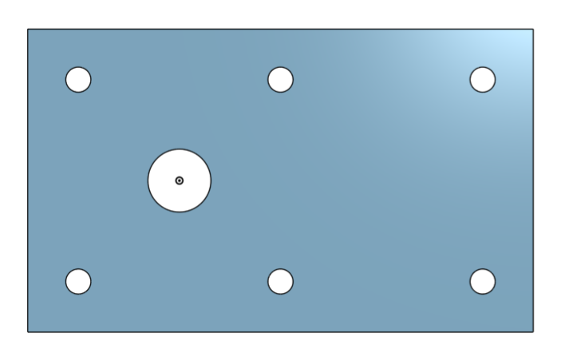

### Link
[Link to OnShape](https://cvilleschools.onshape.com/documents/c50fa4f5b714985a9ecb4188/w/1559368d7bee1b91ddfe9c28/e/676039f8d353db6b20e01b77)

### Reflection
I was surpried by how similar Onshape is to SolidWorks. Once you figure out where everything is, it's relatively simple to use, and it's pretty effective as well.

## Mount

### Description
This is the mount piece for the caster - it is 120 mm by 120 mm and 8 mm thick, and it shares 5 of the holes from the base, including 4 small and the larger one as well.

### Image
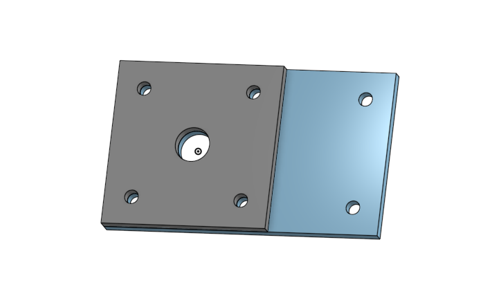 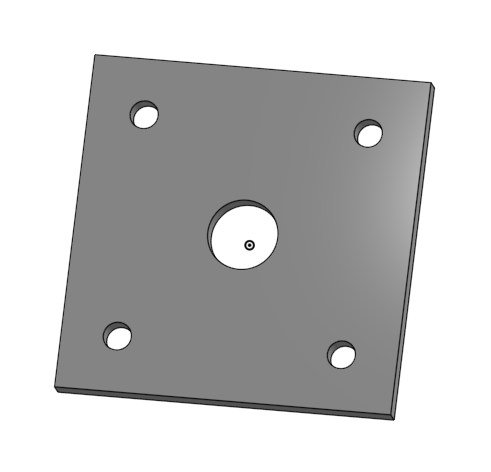

### Link 
[Link](https://cvilleschools.onshape.com/documents/c50fa4f5b714985a9ecb4188/w/1559368d7bee1b91ddfe9c28/e/676039f8d353db6b20e01b77)

### Reflection
The mount for the caster was surprisingly easy - because you can make several parts in OnShape at the same time, you can base parts after each other. Since the holes on the mount line up with the holes on the base, it's possible to use the "Use" feature in order to copy the edges from the base. With that, though, you can't select the whole sketch when you are extruding, you have to select the potion of that sketch that you want, which is easy enough, since you just have to click on it.

## Fork

### Description
This assignment is for the fork of the caster which holds the wheel. It's based on a small cyclinder, 80 mm in diameter and 8 mm thick, with two "prongs" with fillets, 40 mm by 5 mm and 75 mm high, with a hole extruded through both prongs. The shaft of the fork is made up of two concentric circles, 15 and 20 mm, and 60 mm deep, with a chamfer on the edges.

### Image
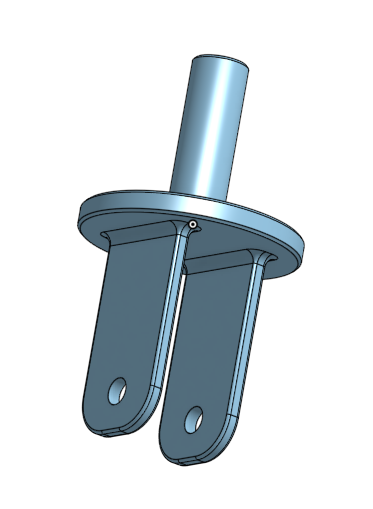

### Link
[Link](https://cvilleschools.onshape.com/documents/c50fa4f5b714985a9ecb4188/w/1559368d7bee1b91ddfe9c28/e/9d42a9123c746d6a105cdc09)

### Reflection
This was, again, pretty easy - very similar to SolidWorks. The keyboard shortcuts are good; I suppose that's different from SolidWorks - most of them make sense as well, which is nice (c for circle, r for rectangle, etc.).

## Tire

### Description
This is the tire for the wheel of the caster. It is a revolve, not an extrude, and the basic shape is a symmetrical trapezoid, revolved, then filletted to round it out. 

### Image
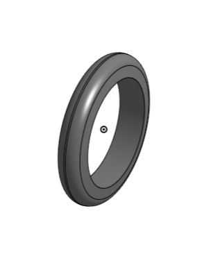

### Link
[Link](#https://cvilleschools.onshape.com/documents/c50fa4f5b714985a9ecb4188/w/1559368d7bee1b91ddfe9c28/e/4ff4ade5d4f1bb438e030dfa)

### Reflection
This was fairly simple - the revolve feature in OnShape is good, but I did notice that it doesn't have degrees of rotation like SolidWorks did. 

## Wheel

### Description
This is the wheel that goes with the tire for the caster. It starts as an oddly shaped combination of rectangles, which is revolved around a horizontal centre line to form a wheel shape with a wider edge and centre than the middle bit. Then, holes are extruded out of it and the edges filleted, then patterned circularly, to be finished with a fillet of the entirety of the faces on both sides of the wheel.

### Image
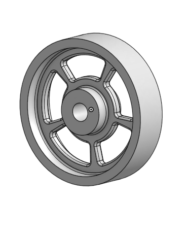 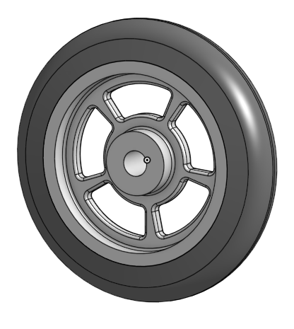

### Link
[Link](https://cvilleschools.onshape.com/documents/c50fa4f5b714985a9ecb4188/w/1559368d7bee1b91ddfe9c28/e/4ff4ade5d4f1bb438e030dfa)

### Reflection
The trim feature does NOT have a power trim setting that I could find - it's honestly annoying to go around clicking all the little bits :unamused:. The circular feature pattern bit is fine; the fillet feature is good; I do think it's interesting that you can extrude a cut in Onshape rather than having to make a hole or whatever it was in SolidWorks - isn't that the opposite of what extrude means anyways?

## AxleCollar

### Description
These are the axle and collar for the wheel of the caster. The axle is a hollow cylinder, with interior diameter 6 mm and exterior 10 mm, 60 mm deep symettric to the middle. It has a mirrored cutout for two flat parts at the ends. The collar is based on the geometry of the axle: the interior diameter is 10 mm and the exterior is 15mm. It has a 3 mm hole in it that goes through to the flat part on the end of the axle.

### Image
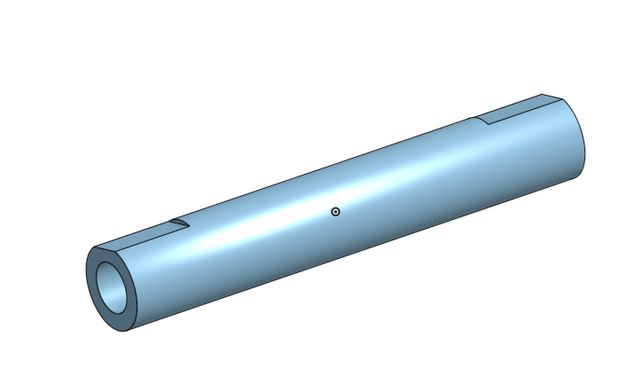 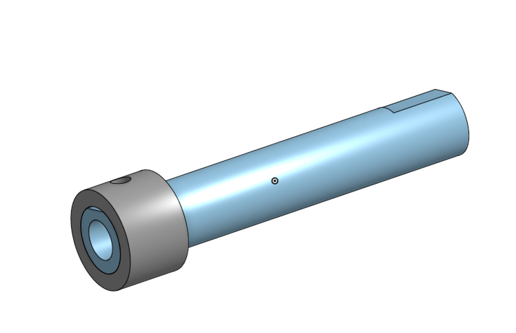 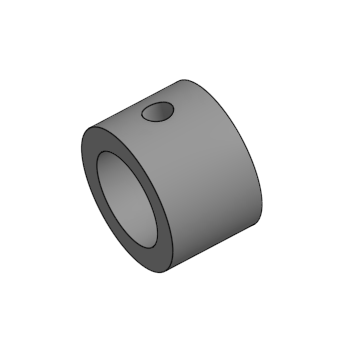

### Link
[Link](https://cvilleschools.onshape.com/documents/c50fa4f5b714985a9ecb4188/w/1559368d7bee1b91ddfe9c28/e/56a93cc6954f9d67b82221fc)

### Reflection
The "use" feature is very useful - it makes the whole process just that much faster because you don't have to make another shape the same as one you've already done. I love that you can make several parts at once as well in OnShape, it's really quite nice. The part studios for division is good too, so that you can make multiple parts in the same document, but not neccessarily all in the same space. It's really great that you can use the through all feature but still only apply it to one of the parts, as it makes removing through extrusion much easier.

## Bearing

### Description
This is a small bearing for the wheel of the caster - it actually shares the dimensions of the middle circular face of the wheel of the caster, so I sketched it in the same part studio as the wheel, just using the "use" feature for the dimensions, and extruding it 5 mm thick.

### Image
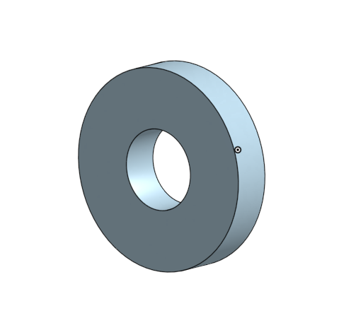 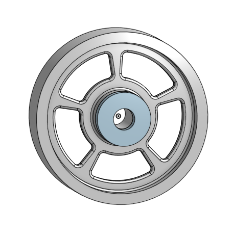

### Link
[Link](https://cvilleschools.onshape.com/documents/c50fa4f5b714985a9ecb4188/w/1559368d7bee1b91ddfe9c28/e/4ff4ade5d4f1bb438e030dfa)

### Reflection
Again, the use feature makes this very simple - this was definitely the easiest part to make, because there was no real sketching involved at all.

## Washer

### Description
This is the final independent piece for the caster - the washer. It's just a very simple hollow cylinder, 20 mm interior diameter, 30 mm exterior diameter, 5mm thick.

### Image
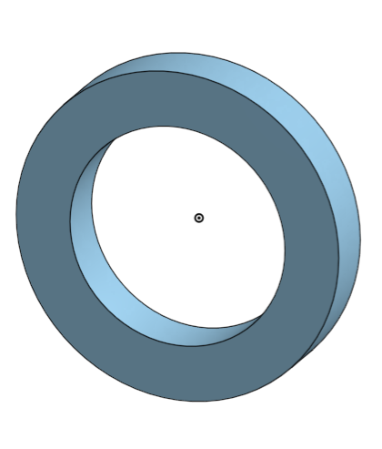

### Link
[Link](https://cvilleschools.onshape.com/documents/c50fa4f5b714985a9ecb4188/w/1559368d7bee1b91ddfe9c28/e/cb34e1dbfe6ce2d209f412e9)

### Reflection
This part was just super simple - I was able to do it very quickly. 
Overall, making all of these parts has shown me how similar to SolidWorks OnShape really is. Having used SolidWorks a lot last year, doing all of these little parts in OnShape has been pretty easy with the provided instructions, and honestly kind of fun. In general, I think OnShape is better set up than SolidWorks, and I never have to worry about losing my progress or trying to figure out how to get back to something after I've screwed up again (yay!).

## SubAssembly

### Description
The sub-assembly is a combination of the wheel, tire, axle, and two bearings made earlier in the process. They are put together using OnShape mating features. 

### Image
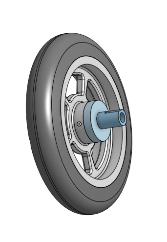 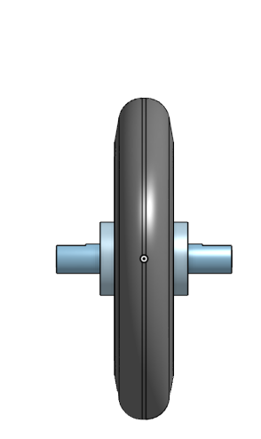 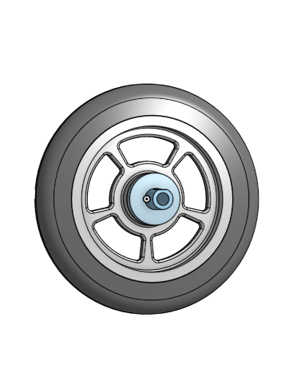

### Link
[Link](https://cvilleschools.onshape.com/documents/c50fa4f5b714985a9ecb4188/w/1559368d7bee1b91ddfe9c28/e/60e0aa2a7e88781b971503bf)

### Reflection
The mate features are pretty different in OnShape - there are different types, including the ones used in this sub-assembly: the fasten mate and the revolute mate. By using "mate connectors" of specific parts, you can mate parts easily in relation to other parts or features of the document (such as the origin). The fasten mate fixes a part in place in reltion to it's mate connector, significantly limiting the movement of that part. When I used the fasten mate for the wheel to the origin, it was unable to move entirely. The revolute mate fixes a part in places, but still allows it to rotate, as the name suggests, unlike a fasten mate.

## FinalProduct

### Description
This assembly contains all the parts made in the previous sections of this project and the sub-assembly from the last section. It also includes several standard parts, including nuts and bolts. All of the pieces are mated together and organised into an actual caster!

### Image
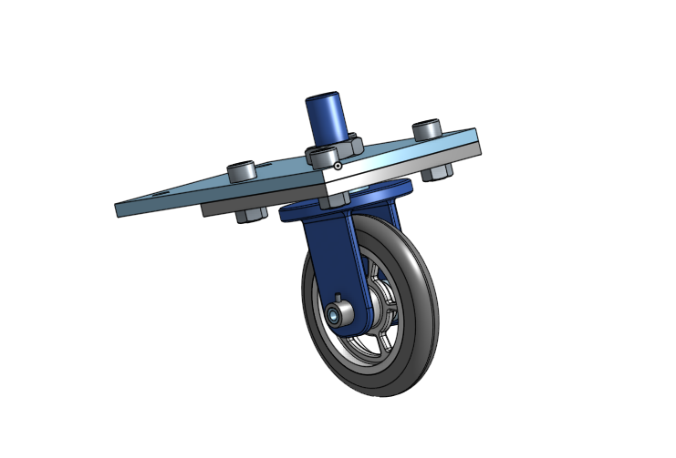 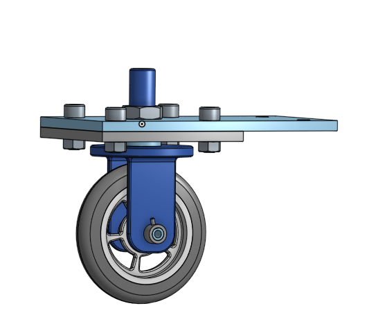

### Link
[Link](https://cvilleschools.onshape.com/documents/c50fa4f5b714985a9ecb4188/w/1559368d7bee1b91ddfe9c28/e/16d0462e45dc0036790aa141)

### Reflection
The mates system in OnShape is pretty cool - I think it will definitely save a lot of time doing CAD in projects in the future, because you can pretty much get any object where it needs to be in one or two mates, and it seems that usually, you only need one. That way, it would be easier to tell what mate is wrong and why, and I think it will make troubleshooting projects easier in the future. It's nice that you can use the 'm' key for mates, but you do have to check that it's executing the right type of mate as well.

Overall, I found that this project was a good introduction to OnShape, and I feel that I have a working knowledge of it now. Between working on individual parts and working on assemblies and sub-assemblies, OnShape is streamlined and effective to use - I think it's a great addition to the Engineering courses, and it's especially nice because it's collaborative and accesible on chromebooks.

## DorothysDowelPins

### Description
This assignment consisted of building a picture frame of dowel pins and frame parts. It concentrated on the use of configurations to make slightly different variations of the same pieces. The pins had to have diameters of 1/4 in, 3/8 in, 1/2 in, and 5/8 in, and lengths of 1/2 in, 1 in, 1 1/2 in, and 2 in, and be able to have or not have chamfered edges. OnShape gives you a little menu at the top to pick which characteristics you want a piece to have, and you can change this as well when putting a part in an assembly. The frame is made up of trapezoid bases, one 1 ft long, the other 1 1/2 ft long at it's longest edge, each 3/4 in thick. I composed the frame assmebly with revolute and fasten mates, using two of each configuration of the frame parts, four 1/2 in diameter x 1/2 in length pins, and four 1/2 in diameter x 1 1/2 in length pins.

### Image
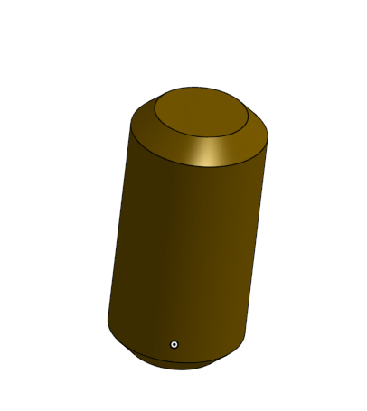 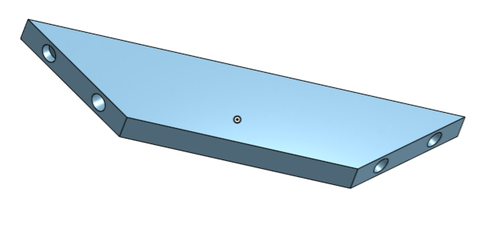 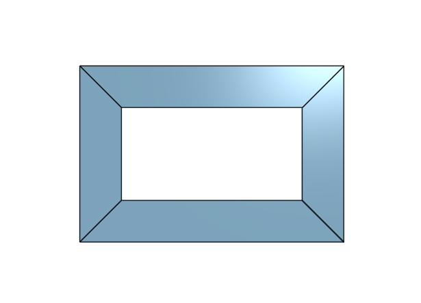

### Link
[Link](https://cvilleschools.onshape.com/documents/b1096c359f89f14504d93b4c/w/22474111a026d8e585338eca/e/4d354edadbc7aedaf1b0b316)

### Reflection
The configuration feature in OnShape is pretty good - it's fairly easy to use, and it's pretty well organised. I like the little menu where you can click which characteristics you want the piece to have - I don't remember if SolidWorks had anything like that, but it's pretty neat. The instructions for the frame piece were kind of vague, so that took a little thinking, but in general, this mini project was fairly simple, and a good introduction to configurations in OnShape.
